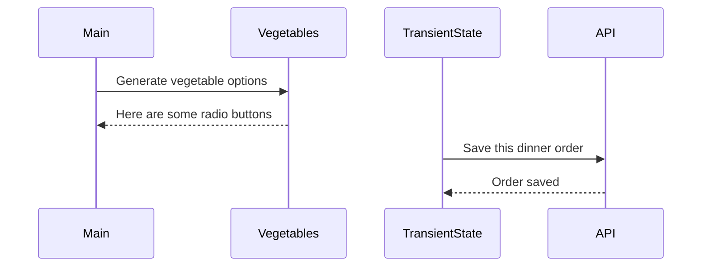

# Events and State Self-Assessment

> 🧨 Make sure you answer the vocabulary and understanding questions at the end of this document before notifying your coaches that you are done with the project

## Setup

1. Make sure you are in your `workspace` directory
1. `git clone {github repo SSH string}`
1. `cd` into the directory it creates
1. `code .` to open the project code
1. Use the `serve` command to start the web server
1. Open the URL provided in Chrome

## Requirements

### Initial Render

1. All 10 base dishes should be displayed as radio input options.
1. All 9 vegetables should be displayed as radio input options.
1. All 6 side dishes should be displayed as radio input options.
1. All previously purchases meals should be displayed below the meal options. Each purchase should display the primary key and the total cost of the purcahsed meal.

### State Management

1. When the user selects an item in any of the three columns, the choice should be stored as transient state.
1. When a user makes a choice for all three kinds of food, and then clicks the "Purchase Combo" button, a new sales object should be...
    1. Stored as permanent state in your local API.
    1. Represented as HTML below the **Monthly Sales** header in the following format **_exactly_**. Your output will not have zeroes, but the actual amount.
        ```html
        Receipt #1 = $00.00
        ```
   1. The user's choices should be cleared from transient state once the purchase is made.

## Design

Given the description and animation above...

1. Create an ERD for this application before you begin.
1. Make a list of what modules need to be created to make your application as modular as possible. Create a **Dependency Graph** for the project to be reviewed once you are complete with the assessment.
1. Create a **Sequence Diagram** that visualizes what your algorithm is for this project. We'll give you a minimal starting point.



## Vocabulary and Understanding

> 🧨 Before you click the "Assessment Complete" button on the Learning Platform, add your answers below for each question and make a commit. It is your option to request a face-to-face meeting with a coach for a vocabulary review.

1. Should transient state be represented in a database diagram? Why, or why not?
   > The transient state should not be represnted in a database diagram. It is temporary data and not persistant data. In the app once the data is submitted the transient state is wiped of any data. 
2. In the **FoodTruck** module, you are **await**ing the invocataion of all of the component functions _(e.g. sales, veggie options, etc.)_. Why must you use the `await` keyword there? Explain what happens if you remove it.
   > Async makes the function return a promise. Aysnc acts as a placeholder of sorts for a value we dont have yet. Await pauses and waits for an outcome before it continues. If you dont have the await, the function runs without a pause and outcome. So when we have an asynchrous task inside our function such as fetch, it will not have time to wait for the fetch outcome to complete, so our promise in this case never resolves. The function will return a promise instead of a value and it will show up as an object promise instead of what you want. 
3. When the user is making choices by selecting radio buttons, explain how that data is retained so that the **Purchase Combo** button works correctly.
   > When we select our radio button the change event is triggered, and a function is invoked. Inside that function we are able to get the value of what is stored. We then pass that value as an arugemnt into a function. That function takes that value and assigns it to an object which holds its temporary value.
4. You used the `map()` array method in the self assessment _(at least, you should have since it is a learning objective)_. Explain why that function is helpful as a replacement for a `for..of` loop.
   > Map() is typcially cleaner and less code. It will also run faster. If you are wanting to create a copy of an array, it will automatically do so and create a new array without altering the inital one. For of is more manual than map() in which you have to initialize or  values yourself. I think in this case when we loop through our data such as entree its not as necessary. We are having to use join() to change our data back into a string.